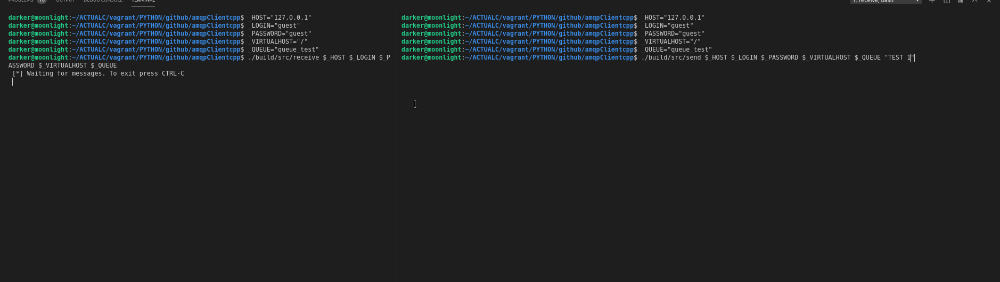

# amqpClientcpp

Just the basic send/receive rabbitmqCpp Client.

## Installation

```shell
sudo apt-get install cmake libpoco-dev
```

## Build

```shell
rm -rf build
mkdir build
cd build
cmake ..
make
```

## How to run

- To send a message in queue :

```shell
# parameters to declare
_HOST="127.0.0.1"
_LOGIN="guest"
_PASSWORD="guest"
_VIRTUALHOST="/"
_QUEUE="queue_test"

_MESSAGE="Bonjour tout le monde"

./build/src/send $_HOST $_LOGIN $_PASSWORD $_VIRTUALHOST $_QUEUE $MESSAGE
```

- To receive message from a queue :

```shell
# parameters to declare
_HOST=127.0.0.1
_LOGIN=guest
_PASSWORD=guest
_VIRTUALHOST=/
_QUEUE=queue_test

./build/src/receive $_HOST $_LOGIN $_PASSWORD $_VIRTUALHOST $_QUEUE
```

## Demo



## Author

- Sanix-darker